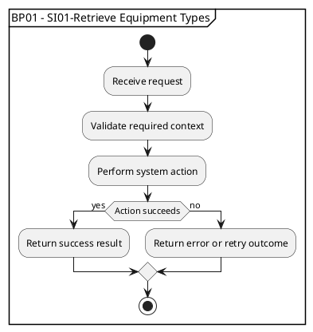

# Workflow Documenter

Use this skill when a project contains BPMN workflow diagrams and the user wants documentation, system interaction extraction, PlantUML activity diagrams, or rendered SVG outputs.

## Current Project Conventions

The folder structure used in this project is:

- Workflow BPMN files: `1.Workflows/1.WorkflowDiagrams /`
- Workflow Markdown docs: `1.Workflows/`
- System interaction Markdown docs: `2.System Interactions/`
- System interaction PlantUML files: `2.System Interactions/1.SystemInteractionDiagrams/`
- System interaction SVG files: `2.System Interactions/1.SystemInteractionDiagrams/`

Important: `1.WorkflowDiagrams ` has a trailing space in the directory name. Always quote paths that include this folder or `2.System Interactions`.

## Workflow Documentation

For each BPMN file, create or update a Markdown file in `1.Workflows/` named after the workflow, for example:

- BPMN: `1.Workflows/1.WorkflowDiagrams /BP01-RegisterEquipment.bpmn`
- Markdown: `1.Workflows/BP01-RegisterEquipment.md`

Each Markdown file should include:

- Title using the workflow code and readable name.
- Source diagram path.
- `Workflow Description`: short summary of the flow.
- `Intention`: short summary of the business/system goal.
- `System Interactions`: a flat bullet list of every system interaction in the diagram.

Use this structure:

```markdown
# BP01 - Register Equipment

Source diagram: `1.WorkflowDiagrams /BP01-RegisterEquipment.bpmn`

## Workflow Description

...

## Intention

...

## System Interactions

- SI01-Retrieve Equipment Types
```

## System Interaction Naming

System interactions are BPMN task or user task labels prefixed with `SI`.

Normalize all system interactions to this format:

```text
SI[number]-[name]
```

Examples:

- `SI01-Retrieve Equipment Types`
- `SI02-Send Account Registration Notification`
- `SI03-Confirm Account Registration`

Rules:

- Start a new number series for each workflow diagram.
- Use two digits: `SI01`, `SI02`, `SI03`.
- Preserve the interaction name after the number unless the user asks for wording changes.
- Remove older variants such as `SI-Name`, `SI.Name`, `SI 01 Name`, `Si.Name`, and `SI-01 Name`.
- If duplicate labels are found in the same workflow, call them out before assuming they are intentional.

## Extracting System Interactions

Search BPMN files for interaction names:

```regex
name="SI[0-9]{2}-[^"]+"
```

For unnormalized diagrams, search more broadly:

```regex
name="[^"]*[Ss][Ii][\.\- ]?[^"]+"
```

Use the order in the workflow flow where possible. If XML order differs from visible process order, use the logical business sequence from the diagram.

## PlantUML Activity Diagrams

For each system interaction, create one `.puml` file in `2.System Interactions/1.SystemInteractionDiagrams/`.

Filename format:

```text
BP[number]-SI[number]-Name-With-Hyphens.puml
```

Example:

```text
BP01-SI01-Retrieve-Equipment-Types.puml
```

Each `.puml` file should model what the system must do during that interaction. Keep diagrams concise and implementation-oriented.

Use a top-level `partition` named with the BP/SI title instead of a standalone PlantUML `title`. Place `start` and `stop` inside the partition so the rendered SVG shows the whole interaction inside a frame.

Template:



PlantUML syntax notes:

- Use `start` and `stop`.
- End every action with `;`.
- Use `if (...) then (yes)`, `else (no)`, and `endif` for decisions.
- If a renderer rejects a question mark in an `if` label, rewrite it as a statement, for example `if (Information is complete) then (yes)`.
- Keep partition names aligned with BPMN and Markdown labels.

## System Interaction Markdown Documentation

For each system interaction, create one Markdown file in `2.System Interactions/` named after the interaction diagram.

Filename format:

```text
BP[number]-SI[number]-Name-With-Hyphens.md
```

Example:

```text
BP01-SI01-Retrieve-Equipment-Types.md
```

Each Markdown file should include:

- Title using `BP## - SI##-Name`.
- `Description`: short summary of the system interaction.
- `Diagram`: embedded SVG from `1.SystemInteractionDiagrams/`.

Use this structure:

```markdown
# BP01 - SI01-Retrieve Equipment Types

## Description

The system retrieves the available equipment types so the customer can choose the correct category before starting equipment registration.

## Diagram


```

## Rendering SVGs

This project used Podman with the PlantUML container image because no local `plantuml` CLI or jar was installed.

Render all `.puml` files to `.svg` in the same folder:

```bash
podman run --rm \
  --entrypoint sh \
  -v "/home/lars/dev/builders-clinic/2.System Interactions/1.SystemInteractionDiagrams:/work:Z" \
  -w /work \
  docker.io/plantuml/plantuml \
  -c 'java -jar /opt/plantuml.jar -tsvg /work/*.puml'
```

Notes:

- Use the fully qualified image name `docker.io/plantuml/plantuml`; short-name resolution can fail without a TTY.
- Use `:Z` on the Podman volume mount if the container cannot read the mounted folder.
- Do not quote `*.puml` as an argument to PlantUML directly; run it through the container shell so the glob expands inside the container.

Verify SVG output:

```bash
glob "*.svg" path="/home/lars/dev/builders-clinic/2.System Interactions/1.SystemInteractionDiagrams"
```

Expected result for this project after the latest pass:

- 27 `.puml` files.
- 27 `.svg` files.

## Verification Checklist

After changes, verify:

- Every BPMN `SI` label uses `SI##-Name`.
- Every workflow Markdown file lists the same SI labels as its BPMN file.
- Every SI label has a matching `.puml` file.
- Every `.puml` file has matching `@startuml` and `@enduml`.
- Every `.puml` file uses a top-level `partition "BP## - SI##-Name"` instead of `title`.
- Every `.puml` file has `start` and `stop` inside the partition.
- Every `.puml` file has a matching `.svg` after rendering.
- Every SI label has a matching Markdown file in `2.System Interactions/` with an embedded SVG.
- No old labels remain with `SI-Name`, `SI.Name`, `Si.Name`, or numbered forms like `SI-01 Name`.

Useful searches:

```regex
SI-[A-Za-z]
SI\.[A-Za-z]
Si\.
SI-[0-9]+\s
SI[0-9]{2}-
```

## Collaboration Notes

- The user may move folders during the work. Always rescan structure before acting on paths.
- If a requested folder name differs from the current structure, use the current scanned structure and mention the discrepancy briefly.
- Preserve user edits and do not revert or rename folders unless explicitly asked.
- When rendering, explain any dependency issue directly and offer a practical route: local `plantuml`, `plantuml.jar`, or Podman container.
