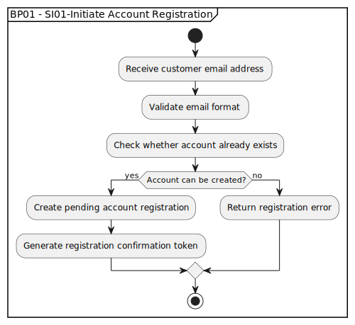

# BP01 - SI01-Initiate Account Registration

## Description

The system starts customer account registration by accepting the provided email address and preparing the account creation flow.

## Diagram

## Operations

| Operation | Input | Output | Notes |
| --- | --- | --- | --- |
| Receive customer email address | Customer email address | Registration request captured | Starts account registration from the customer-provided email. |
| Validate email format | Customer email address | Validated email or format error | Ensures the email can be used for account registration. |
| Check whether account already exists | Validated email | Account availability result | Prevents duplicate account creation for the same email. |
| Create pending account registration | Available email address | Pending account registration | Creates the inactive account registration record. |
| Generate registration confirmation token | Pending account registration | Confirmation token | Produces the token used by the activation link. |
| Broadcast Account Registered event | Pending registration and token | Account Registered event | Triggers downstream notification handling. |
| Return registration error | Invalid or duplicate registration request | Registration error response | Stops the flow when the account cannot be created. |
