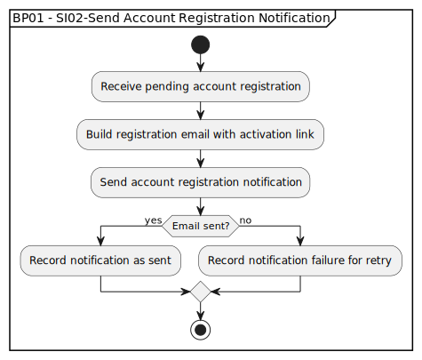

# BP01 - SI02-Send Account Registration Notification

## Description

The system sends the customer an account registration notification containing the link or instructions needed to continue onboarding.

## Diagram

## Operations

| Operation | Input | Output | Notes |
| --- | --- | --- | --- |
| Receive pending account registration | Pending account registration | Notification request accepted | Starts notification processing for the pending registration. |
| Build registration email with activation link using confirmation token | Registration details and token | Registration email content | Creates the message the customer uses to activate the account. |
| Send account registration notification | Registration email content | Email delivery attempt | Sends the activation email to the customer. |
| Record notification as sent | Successful delivery result | Sent notification record | Captures successful delivery for audit and status tracking. |
| Record notification failure for retry | Failed delivery result | Retryable failure record | Keeps failed notifications available for retry handling. |
