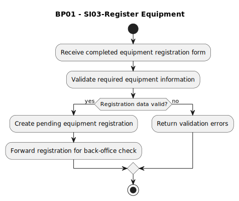

# BP01 - SI03-Register Equipment

## Description

The system receives the submitted equipment registration details, validates the required information, and creates the initial equipment registration record.

## Diagram

