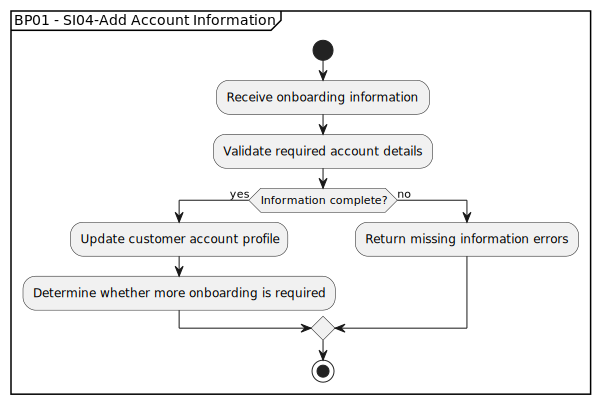

# BP01 - SI04-Add Account Information

## Description

The system captures additional onboarding information for the customer account and stores it before redirecting the customer into the application.

## Diagram

## Operations

| Operation | Input | Output | Notes |
| --- | --- | --- | --- |
| Receive onboarding information | Customer onboarding details | Onboarding submission captured | Accepts additional data needed for the customer profile. |
| Validate required account details | Onboarding submission | Validation result | Checks that mandatory profile information is present and usable. |
| Update customer account profile | Valid onboarding details | Updated account profile | Stores the customer-provided onboarding information. |
| Determine whether more onboarding is required | Updated account profile | Next onboarding state | Decides whether the customer can continue into the application. |
| Return missing information errors | Incomplete onboarding details | Missing information response | Tells the customer which required details must be provided. |
