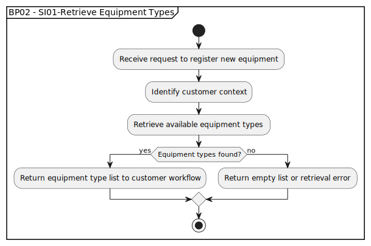

# BP02 - SI01-Retrieve Equipment Types

## Description

The system retrieves the available equipment types so the customer can choose the correct category before starting equipment registration.

## Diagram

## Operations

| Operation | Input | Output | Notes |
| --- | --- | --- | --- |
| Receive request to register new equipment | Equipment registration request | Request accepted | Starts equipment registration by accepting the customer's request. |
| Identify customer context | Registration request | Customer context | Determines which customer is registering equipment. |
| Retrieve available equipment types | Customer context | Equipment type lookup result | Loads equipment types available for registration. |
| Return equipment type list to customer workflow | Equipment types | Equipment type list | Provides selectable equipment types to the workflow. |
| Return empty list or retrieval error | Missing equipment types or lookup failure | Empty list or error response | Handles unavailable equipment type data. |
