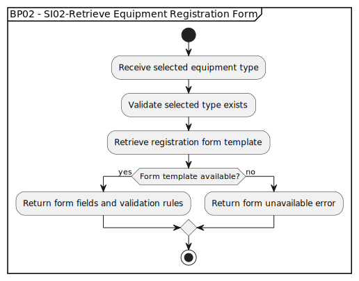

# BP02 - SI02-Retrieve Equipment Registration Form

## Description

The system loads the registration form and required fields for the selected equipment type so the customer can provide the needed details.

## Diagram

## Operations

| Operation | Input | Output | Notes |
| --- | --- | --- | --- |
| Receive selected equipment type | Selected equipment type | Form request accepted | Starts form retrieval for the chosen equipment type. |
| Validate selected type exists | Selected equipment type | Type validation result | Confirms the chosen type is supported. |
| Retrieve registration form template | Valid equipment type | Form template lookup result | Loads the fields and rules needed for registration. |
| Return form fields and validation rules | Form template | Registration form definition | Gives the customer workflow the form to display. |
| Return form unavailable error | Missing form template | Form unavailable response | Reports that the selected type cannot currently be registered. |
