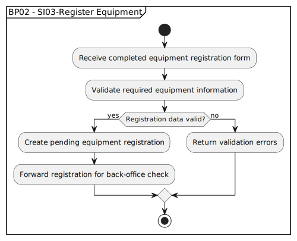

# BP02 - SI03-Register Equipment

## Description

The system receives the submitted equipment registration details, validates the required information, and creates the initial equipment registration record.

## Diagram

## Operations

| Operation | Input | Output | Notes |
| --- | --- | --- | --- |
| Receive completed equipment registration form | Completed registration form | Registration submission captured | Accepts the customer's equipment details. |
| Validate required equipment information | Registration submission | Validation result | Checks required fields before creating the registration. |
| Create pending equipment registration | Valid equipment details | Pending equipment registration | Stores the submitted equipment as pending review. |
| Forward registration for back-office check | Pending equipment registration | Back-office review task | Sends the registration to back office for validation. |
| Return validation errors | Invalid registration submission | Validation error response | Tells the customer which equipment details must be corrected. |
