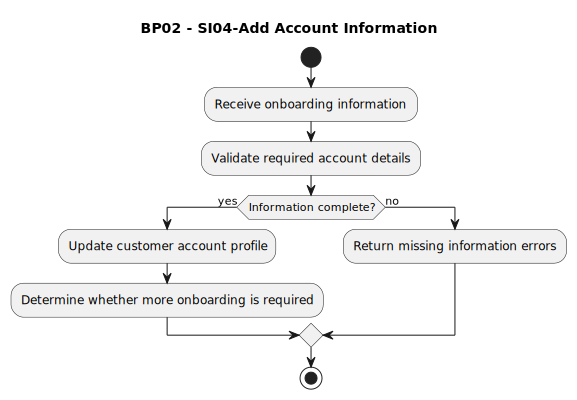

# BP02 - SI04-Add Account Information

## Description

The system captures additional onboarding information for the customer account and stores it before redirecting the customer into the application.

## Diagram

