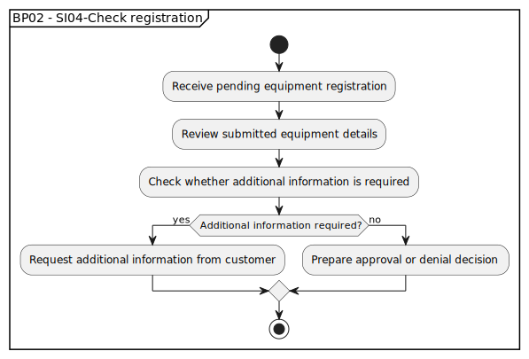

# BP02 - SI04-Check registration

## Description

The system supports the registration check by validating the submitted equipment information and determining whether more information is needed.

## Diagram

## Operations

| Operation | Input | Output | Notes |
| --- | --- | --- | --- |
| Receive pending equipment registration | Pending equipment registration | Review request accepted | Starts back-office validation of submitted equipment. |
| Review submitted equipment details | Pending equipment registration | Reviewed equipment details | Lets back office inspect the submitted information. |
| Check whether additional information is required | Reviewed equipment details | Additional information decision | Determines whether the customer must provide more data. |
| Request additional information from customer | Information gap decision | Additional information request | Asks the customer to complete or correct the registration. |
| Prepare approval or denial decision | Complete reviewed registration | Approval or denial decision | Moves the registration toward finalization. |
