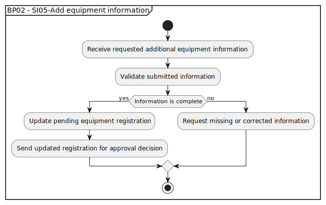

# BP02 - SI05-Add equipment information

## Description

The system records additional equipment information supplied by the customer and updates the pending equipment registration.

## Diagram

## Operations

| Operation | Input | Output | Notes |
| --- | --- | --- | --- |
| Receive requested additional equipment information | Additional equipment details | Additional information submission captured | Accepts the customer's response to the information request. |
| Validate submitted information | Additional equipment details | Validation result | Checks whether the submitted information satisfies the request. |
| Update pending equipment registration | Valid additional information | Updated pending registration | Adds the supplied details to the existing registration. |
| Send updated registration for approval decision | Updated pending registration | Approval review request | Returns the completed registration to back office. |
| Request missing or corrected information | Incomplete or invalid information | Follow-up information request | Keeps the registration open until the information is complete. |
