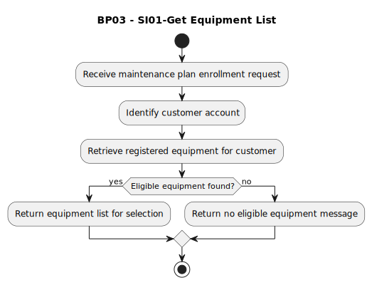

# BP03 - SI01-Get Equipment List

## Description

The system retrieves the customer's eligible equipment list so the customer can select equipment for maintenance-plan enrollment.

## Diagram

## Operations

| Operation | Input | Output | Notes |
| --- | --- | --- | --- |
| Receive maintenance plan enrollment request | Enrollment request | Request accepted | Starts maintenance-plan enrollment. |
| Identify customer account | Enrollment request | Customer account context | Determines which customer's equipment should be retrieved. |
| Retrieve registered equipment for customer | Customer account context | Registered equipment lookup result | Finds equipment eligible for maintenance-plan enrollment. |
| Return equipment list for selection | Eligible equipment | Equipment selection list | Provides equipment options to the customer. |
| Return no eligible equipment message | Empty equipment lookup result | No eligible equipment message | Explains that enrollment cannot continue without eligible equipment. |
