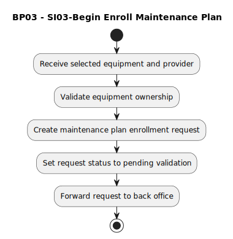

# BP03 - SI03-Begin Enroll Maintenance Plan

## Description

The system starts the maintenance-plan enrollment process using the selected equipment and provider information.

## Diagram

## Operations

| Operation | Input | Output | Notes |
| --- | --- | --- | --- |
| Receive selected equipment and provider | Selected equipment and provider | Enrollment selection captured | Accepts the customer's enrollment choices. |
| Validate equipment ownership | Selected equipment and customer context | Ownership validation result | Ensures the equipment belongs to the requesting customer. |
| Create maintenance plan enrollment request | Valid selection | Enrollment request | Creates the pending maintenance-plan request. |
| Set request status to pending validation | Enrollment request | Pending validation status | Marks the request for back-office review. |
| Forward request to back office | Pending enrollment request | Back-office review task | Sends the request for validation and decisioning. |
