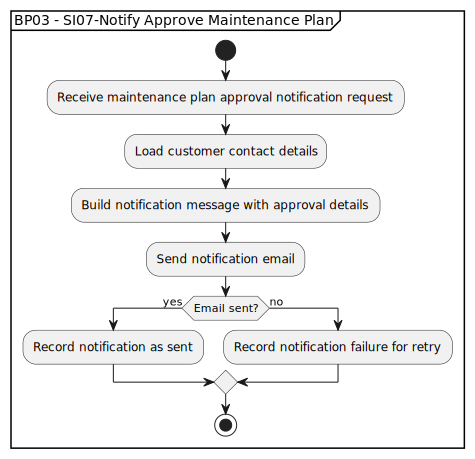

# BP03 - SI07-Notify Approve Maintenance Plan

## Description

The system notifies the customer that the maintenance-plan enrollment request was approved.

## Diagram

## Operations

| Operation | Input | Output | Notes |
| --- | --- | --- | --- |
| Receive maintenance plan approval notification request | Approval notification request | Notification request accepted | Starts customer notification for an approved maintenance plan. |
| Load customer contact details | Approved enrollment | Customer contact details | Retrieves the destination for the notification. |
| Build notification message with approval details | Approval details and contact context | Approval notification content | Creates the customer-facing approval message. |
| Send notification email | Approval notification content | Email delivery attempt | Sends the approval email to the customer. |
| Record notification as sent | Successful delivery result | Sent notification record | Captures successful notification delivery. |
| Record notification failure for retry | Failed delivery result | Retryable failure record | Keeps failed notifications available for retry handling. |
