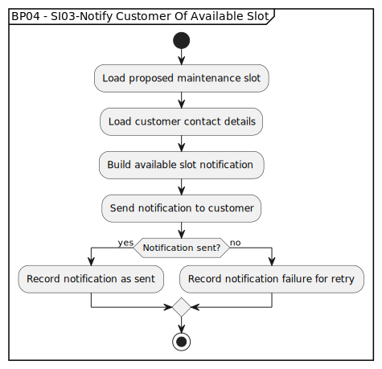

# BP04 - SI03-Notify Customer Of Available Slot

## Description

The system notifies the customer of the available maintenance slot so the customer can accept or decline it.

## Diagram

## Operations

| Operation | Input | Output | Notes |
| --- | --- | --- | --- |
| Load proposed maintenance slot | Proposed slot reference | Proposed slot details | Retrieves the slot to present to the customer. |
| Load customer contact details | Customer context | Customer contact details | Retrieves the notification destination. |
| Build available slot notification | Slot details and contact context | Available slot notification content | Creates the customer-facing slot proposal message. |
| Send notification to customer | Available slot notification content | Notification delivery attempt | Sends the proposed slot to the customer. |
| Record notification as sent | Successful delivery result | Sent notification record | Captures successful notification delivery. |
| Record notification failure for retry | Failed delivery result | Retryable failure record | Keeps failed notifications available for retry handling. |
