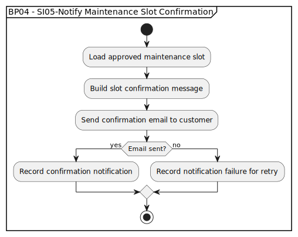

# BP04 - SI05-Notify Maintenance Slot Confirmation

## Description

The system sends the customer a confirmation notification after the maintenance slot has been approved.

## Diagram

## Operations

| Operation | Input | Output | Notes |
| --- | --- | --- | --- |
| Load approved maintenance slot | Approved slot reference | Approved slot details | Retrieves confirmed slot information for the message. |
| Build slot confirmation message | Approved slot details | Confirmation message content | Creates the customer-facing confirmation message. |
| Send confirmation email to customer | Confirmation message content | Email delivery attempt | Sends the confirmed slot details to the customer. |
| Record confirmation notification | Successful delivery result | Sent confirmation record | Captures successful confirmation delivery. |
| Record notification failure for retry | Failed delivery result | Retryable failure record | Keeps failed notifications available for retry handling. |
