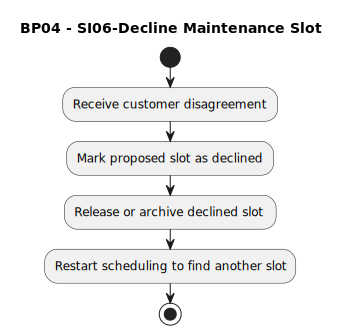

# BP04 - SI06-Decline Maintenance Slot

## Description

The system records the customer's decline of the proposed maintenance slot and supports restarting the scheduling loop.

## Diagram

## Operations

| Operation | Input | Output | Notes |
| --- | --- | --- | --- |
| Receive customer disagreement | Customer slot disagreement | Disagreement captured | Starts decline handling when the customer rejects the proposed slot. |
| Mark proposed slot as declined | Proposed slot and disagreement | Declined slot status | Records that the proposed slot was not accepted. |
| Release or archive declined slot | Declined slot | Released or archived slot | Frees or stores the slot according to scheduling rules. |
| Restart scheduling to find another slot | Declined scheduling request | New scheduling cycle | Sends the workflow back to find another option. |
