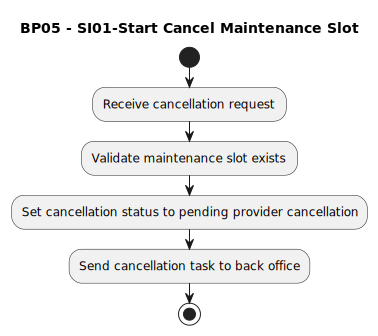

# BP05 - SI01-Start Cancel Maintenance Slot

## Description

The system starts the maintenance-slot cancellation process after the customer requests cancellation.

## Diagram

## Operations

| Operation | Input | Output | Notes |
| --- | --- | --- | --- |
| Receive cancellation request | Cancellation request | Request accepted | Starts cancellation for an existing maintenance slot. |
| Validate maintenance slot exists | Slot reference | Slot validation result | Confirms there is a slot that can be cancelled. |
| Set cancellation status to pending provider cancellation | Valid slot | Pending provider cancellation status | Tracks that provider coordination is required. |
| Send cancellation task to back office | Pending cancellation | Back-office cancellation task | Hands off cancellation coordination to back office. |
