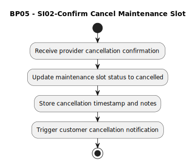

# BP05 - SI02-Confirm Cancel Maintenance Slot

## Description

The system confirms that the maintenance slot cancellation has been completed and updates the slot status accordingly.

## Diagram

## Operations

| Operation | Input | Output | Notes |
| --- | --- | --- | --- |
| Receive provider cancellation confirmation | Provider confirmation | Cancellation confirmation accepted | Starts final cancellation after provider confirmation. |
| Update maintenance slot status to cancelled | Provider confirmation and slot | Cancelled slot status | Marks the maintenance slot as cancelled. |
| Store cancellation timestamp and notes | Cancellation details | Stored cancellation audit data | Captures when and why the cancellation was confirmed. |
| Trigger customer cancellation notification | Cancelled slot | Customer notification request | Starts notification that the slot has been cancelled. |
