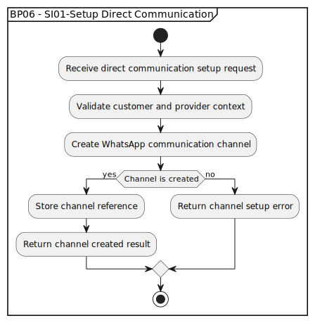

# BP06 - SI01-Setup Direct Communication

## Description

The system sets up a direct communication channel between the customer and provider.

## Diagram

## Operations

| Operation | Input | Output | Notes |
| --- | --- | --- | --- |
| Receive direct communication setup request | Communication setup request | Setup request accepted | Starts creation of the customer-provider channel. |
| Validate customer and provider context | Customer and provider context | Context validation result | Confirms the participants can be connected. |
| Create WhatsApp communication channel | Valid participant context | Channel creation result | Creates the WhatsApp channel used for direct communication. |
| Store channel reference | Created channel | Stored channel reference | Persists the channel identifier for later messages. |
| Return channel created result | Stored channel reference | Channel created response | Confirms successful channel setup to the workflow. |
| Return channel setup error | Failed channel creation | Channel setup error response | Reports that direct communication could not be created. |
