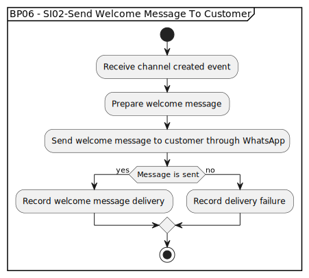

# BP06 - SI02-Send Welcome Message To Customer

## Description

The system sends a welcome message to the customer after the direct communication channel is created.

## Diagram

## Operations

| Operation | Input | Output | Notes |
| --- | --- | --- | --- |
| Receive channel created event | Channel created event | Welcome message request accepted | Starts welcome messaging after channel creation. |
| Prepare welcome message | Channel and customer context | Welcome message content | Builds the initial WhatsApp message for the customer. |
| Send welcome message to customer through WhatsApp | Welcome message content | WhatsApp delivery attempt | Sends the welcome message through the direct channel. |
| Record welcome message delivery | Successful delivery result | Delivery record | Captures successful welcome message delivery. |
| Record delivery failure | Failed delivery result | Delivery failure record | Records failed delivery for follow-up or retry. |
