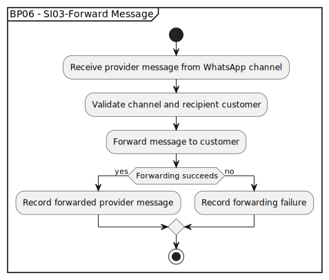

# BP06 - SI03-Forward Message

## Description

The system forwards a provider message to the customer through the direct communication channel.

## Diagram

## Operations

| Operation | Input | Output | Notes |
| --- | --- | --- | --- |
| Receive provider message from WhatsApp channel | Provider WhatsApp message | Forwarding request accepted | Starts forwarding for an incoming provider message. |
| Validate channel and recipient customer | Channel reference and message metadata | Forwarding validation result | Ensures the message belongs to a valid channel and customer. |
| Forward message to customer | Validated provider message | Customer message delivery attempt | Sends the provider message to the customer. |
| Record forwarded provider message | Successful forwarding result | Forwarded message record | Captures successful forwarding for history and audit. |
| Record forwarding failure | Failed forwarding result | Forwarding failure record | Records failed forwarding for investigation or retry. |
